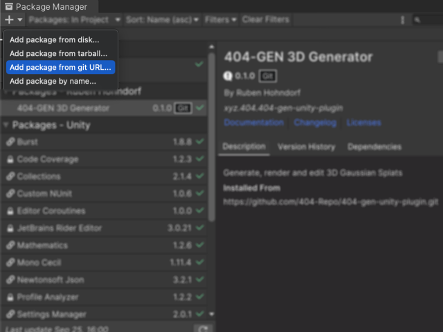
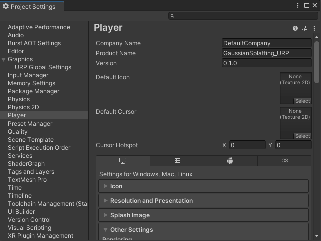
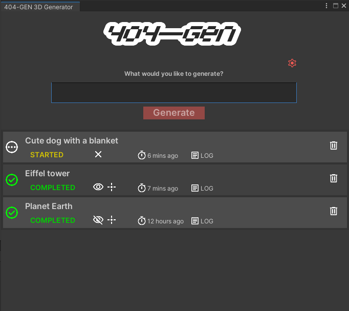

# Unity package for 404—GEN 3D Generator

*404—GEN leverages decentralized AI to transform your words into detailed 3D models, bringing your ideas to life in just a few seconds*  
[Project Repo](https://github.com/404-Repo/three-gen-subnet) | [Website](https://404.xyz/) | [X](https://x.com/404gen_)

## About
#### 3D Gaussian Splatting

3D Gaussian Splatting is a technique used for efficient representation and rendering of three-dimensional objects by leveraging Gaussian distributions.
This technique renders high fidelity objects using lots of tiny translucent ellipsoids or "splats." Each splat carries information about its color, size, position, and opacity.

#### Unity package
  
- With this package, users can:
  - Enter text prompts to generate **3D Gaussian Splats** assets
  - Display **3D Gaussian Splats** assets inside Unity

## Installation

### Software requirements
Unity 2022.3+

### Instructions

#### 1. Open Unity
- From Unity Hub, create a new 3D project (any pipeline)

#### 2. Add the package
* Go to **Window > Package Manager**
* Click the **+** button in the top-left corner
* Select **Add package from git URL...**
* Enter this GitHub repository's URL: `https://github.com/404-Repo/404-gen-unity-plugin.git`
  
  

#### 3. Edit Project Settings
* Go to **Edit > Project Settings...** and go to the **Player** section
* Make sure that the correct rendering backend is selected
    - **D3D12** on Windows
    - **Metal** on Mac
    - **Vulkan** on Linux

  

* Make sure that **Allow 'unsafe' Code** is checked

  

## Usage
### Generating
1. Go to **Window > 404-GEN 3D Generator** to open the generation window
2. Type your prompt and click Generate. Each generation should take **20 to 30 seconds**

The 404-GEN 3D Generator window tracks the progress of generating the models for prompts.
Once the prompt has been enqueued, it waits on the backend to complete the generation.

Generation process changes states from  Started to  Completed or 
  Failed.

Use available action icons to:

  *   cancel active prompt entry
  *  or  show or hide created Gaussian splat model
  *  select generated model in Scene view and Inspector window
  *  resend failed or canceled prompt
  * **LOGS** show log messages in a tooltip
  *  delete prompt entry
  *  open Project settings for this package
    

### Prompts
A prompt is a short text phrase that 404—GEN interprets to create a 3D Gaussian Splat. In this section, we’ll explore how to craft clear and effective prompts, along with tips to refine your input for the best results.
Describe a single element or object, rather than an entire scene. A good rule of thumb is something you can look in toward, rather than out toward, regardless of size. "Sky" wouldn't work, but "planet" would.
Try to be specific but not overly verbose. Prompts between 2 and 12 words in length tend to produce the best results.
You can experiment with keywords for specific styles or materials. A few examples are:
  - Anime
  - Chibi
  - Clay
  - Cute
  - Oil Pastel
  - Papercraft
  - Psychedelic
  - Voxel

> [!NOTE]
> If the network is busy, the operation will automatically be canceled after 1 minute. Try again

## Rendering pipelines Integration
Unity offers three main rendering pipelines:
 - Built-In Render Pipeline (Standard) 
 - Universal Render Pipeline (URP) 
 - High Definition Render Pipeline (HDRP)

The main difference lies in their target applications: the Built-In pipeline is the legacy and general-purpose option, URP balances quality and performance across platforms, and HDRP maximizes visual quality for high-end systems.
As rendering Gaussian splats differs from the regular rendering of 3D models, which are represented with 3D meshes and textures, additional steps need to be taken to integrate 404-Gen 3D generator into URP and HDRP pipelines.
Rendering needs to be modified at a certain point of the pipeline processing.

### Universal Rendering pipeline integration
Universal rendering pipeline uses URP Asset files to configure the graphical features and quality settings.
Render pipeline Asset is a scriptable object that inherits from RenderPipelineAsset.

Along with other Rendering settings it holds a reference to an instance of Universal Renderer Data asset.

**Universal Renderer Data asset** defines the core settings and configurations for rendering, such as the rendering path (forward or deferred), lighting, shadow quality, and more.
It acts as a template for the pipeline to manage and control how the scene is rendered across various cameras and lighting conditions.

To extend the renderer's capabilities, **add a renderer feature** - custom rendering code that augments or modifies the render process for the need of rendering Gaussian splats.
Add a feature **GaussianSplatURPFeature** provided in this package.
This will enable the rendering of splats that get fetched from the 404-Gen 3D Generator.

Default Unity’s URP project template will have three levels of quality by default. These can be seen in **Project Settings** under the **Quality section**.

Each quality level can be set to use a different Render pipeline asset. This is where you can make performance better on lower-end hardware or make graphics look better on higher-end hardware. Adding a **GaussianSplatURPFeature** needs to be applied to all Universal Render Pipeline assets of each quality level where Gaussian splats are required to be rendered.

### High Definition rendering pipeline integration 

HDRP introduces the Volumes approach. Using Volumes allows the scene to be partitioned in areas that have their own specific lighting and effects. HDRP provides a way to customize the render loop using our own implementation of Custom Pass class and injecting the usage of it in a correct place to the rendering process.

Add a new game object to the scene, named *Gaussian Splat Effect*.

In the Inspector window, use the AddComponent button to add a Custom Pass Volume by searching for its name or by following a path
*Scripts > UnityEngine.Rendering.HighDefinition > Custom Pass volume*.
If Gaussian splats are intended to be used on a certain area of the scene, it is possible to restrict their processing to a local area defined by colliders and used only when the rendering camera is within that area. Otherwise a volume needs to be set for global usage, throughout the whole scene.

In added CustomPassVolume component set the Mode to **Global**.

At a certain point of the rendering process an injection to that flow can be made and Custom Pass inserted.

On the Custom Pass Volume component, set the Injection Point to **Before Transparencies** or **After Post Process** (recommended).

For questions or help troubleshooting, visit the Help Forum in our [Discord Server](https://discord.gg/404gen)
