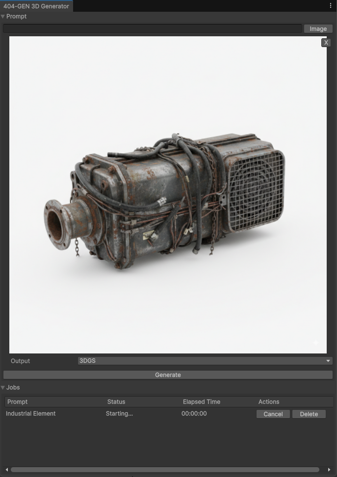

# Unity Package for 404—GEN 3D Generator

*404—GEN leverages decentralized AI to transform your words into detailed 3D models, bringing your ideas to life in just a few seconds*  
[Project Repo](https://github.com/404-Repo/three-gen-subnet) | [Website](https://404.xyz/) | [X](https://x.com/404gen_)

## About
### 3D Gaussian Splatting

3D Gaussian Splatting is a technique used for efficient representation and rendering of three-dimensional objects by leveraging Gaussian distributions.
This technique renders high fidelity objects using lots of tiny translucent ellipsoids or "splats." Each splat carries information about its color, size, position, and opacity.

### Unity Package
  
- With this package, users can:
  - Enter Text or Image Prompts to generate **3D Gaussian Splats (3DGS)** and **Mesh FBX Models**.
  - Display **3D Gaussian Splat** assets inside Unity.
  - Apply **cutouts**, **colliders** and **shadows** to **3D Gaussian Splats**.
  - Import and Export **.ply** files.
  - Convert **3DGS** to **Mesh**.

## Installation

### Software requirements
Unity 2022.3+

### Instructions
*Previous Release must be Removed before Installing Latest Release.*

### 1. Unity Asset Store
- From the [Unity Asset Store](https://assetstore.unity.com/packages/tools/generative-ai/404-gen-3d-generator-311107), click "Add to My Assets".

### 2. Download the Package.
- In Unity, create a new 3D Project or open and existing one.
- Go to **My Assets**.
- Select 404—GEN from the list.
- Click **Download**.

### 3. Install The Package.
- After the package has been downloaded click **Import**.
When the import Window Appears, keep all files selected and click **Import**.

### 4. Restart Unity.
- **Please restart Unity before using the Plugin.**

Make sure the rendering backend is now set to 
- Directx 12 on Windows.
- Metal on Mac OS.
- Vulkan on Linux.

## Usage
### Generating
1. Go to **Window > 404-GEN 3D Generator** to open the generation window.
2. Type your **Text Prompt** or Import your **3D Image Prompt** and click **Generate**. Each generation should take **1 to 2 minutes**.

The 404-GEN 3D Generator window tracks the progress of generating the models for prompts.
Once the prompt has been enqueued, it waits on the backend to complete the generation.

Generation process changes states from  Started to  Completed or 
  Failed.

Use available action icons to:

  *   cancel active prompt entry
  *  or  show or hide created Gaussian splat model
  *  select generated model in Scene view and Inspector window
  *  resend failed or canceled prompt
  * **LOGS** show log messages in a tooltip
  *  delete prompt entry
  *  open Project settings for this package

    
### Prompts
For help with prompts please refer to our [Prompt Guide](https://guide.404.xyz/user-guide/prompts)

For questions or help troubleshooting, visit the Help Forum in our [Discord Server](https://discord.gg/404gen)
